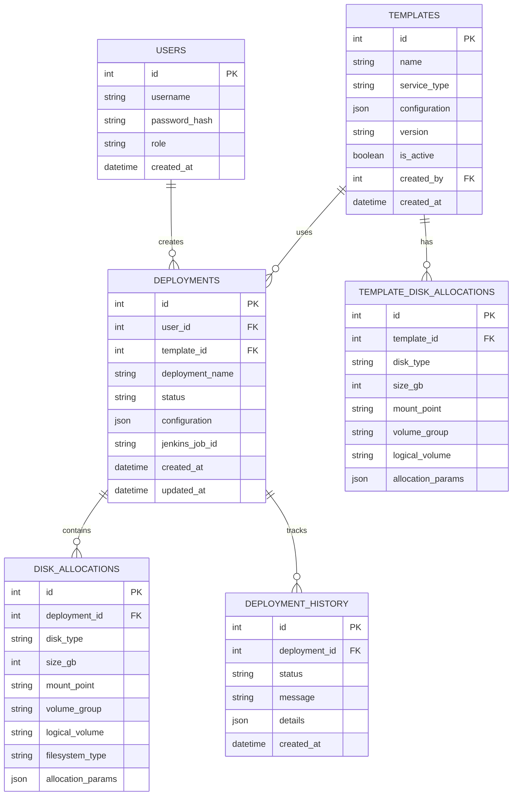

# Database Schema & Data Flow



## Data Flow Diagram

```mermaid
flowchart LR
    User[User Input<br/>Frontend] --> API[Backend API<br/>server.js]
    
    API --> ValidateTemplate{Validate<br/>Template}
    ValidateTemplate --> Templates[(Templates<br/>Table)]
    
    ValidateTemplate -->|Valid| CreateDeploy[Create Deployment<br/>Record]
    CreateDeploy --> Deployments[(Deployments<br/>Table)]
    
    CreateDeploy --> CloneDisk[Clone Disk Allocations<br/>from Template]
    
    Templates --> TemplateDisk[(Template_Disk_<br/>Allocations)]
    TemplateDisk --> CloneDisk
    CloneDisk --> DiskAlloc[(Disk_Allocations<br/>Table)]
    
    Deployments --> TriggerPipeline[Trigger Jenkins<br/>Pipeline]
    DiskAlloc --> TriggerPipeline
    
    TriggerPipeline --> Jenkins[Jenkins Job]
    Jenkins --> UpdateStatus[Update Deployment<br/>Status]
    
    UpdateStatus --> Deployments
    UpdateStatus --> History[(Deployment_<br/>History)]
    
    Jenkins --> RunPlaybook[Execute Ansible<br/>Playbooks]
    DiskAlloc --> RunPlaybook
    RunPlaybook --> Infrastructure[Target<br/>Infrastructure]
    
    Infrastructure --> Callback[Ansible Callback]
    Callback --> UpdateStatus
    
    History --> Frontend[Display Status<br/>in UI]
    Deployments --> Frontend

    style User fill:#4A90E2
    style Frontend fill:#4A90E2
    style API fill:#50C878
    style Jenkins fill:#FF8C42
    style RunPlaybook fill:#FF8C42
    style Templates fill:#9370DB
    style TemplateDisk fill:#9370DB
    style Deployments fill:#9370DB
    style DiskAlloc fill:#9370DB
    style History fill:#9370DB
```



## Table Relationships Explained

### 1. Templates → Deployments
- **One-to-Many**: One template can be used for multiple deployments
- Templates define the blueprint (service type, default configs)
- Each deployment references a template via `template_id`

### 2. Template_Disk_Allocations → Disk_Allocations
- Template disk allocations are **cloned** to deployment-specific allocations
- Allows customization per deployment
- Maintains template immutability

### 3. Deployments → Deployment_History
- **One-to-Many**: Each deployment has multiple history entries
- Tracks status changes over time
- Useful for debugging and auditing

### 4. Users → Deployments
- **One-to-Many**: One user can create multiple deployments
- `user_id` tracks ownership
- Used for permissions and filtering

## Key Database Operations

### Create Deployment Flow
```sql
-- 1. Insert deployment record
INSERT INTO deployments (user_id, template_id, deployment_name, status, configuration)
VALUES (?, ?, ?, 'pending', ?);

-- 2. Get template disk allocations
SELECT * FROM template_disk_allocations WHERE template_id = ?;

-- 3. Clone disk allocations for deployment
INSERT INTO disk_allocations (deployment_id, disk_type, size_gb, mount_point, ...)
SELECT ?, disk_type, size_gb, mount_point, ... FROM template_disk_allocations WHERE template_id = ?;

-- 4. Create history entry
INSERT INTO deployment_history (deployment_id, status, message)
VALUES (?, 'created', 'Deployment created');
```

### Update Deployment Status
```sql
-- 1. Update deployment status
UPDATE deployments 
SET status = ?, updated_at = CURRENT_TIMESTAMP 
WHERE id = ?;

-- 2. Log to history
INSERT INTO deployment_history (deployment_id, status, message, details)
VALUES (?, ?, ?, ?);
```

### Fetch Deployment with Details
```sql
-- Join all related data
SELECT 
    d.*,
    t.name as template_name,
    t.service_type,
    u.username,
    json_group_array(
        json_object(
            'disk_type', da.disk_type,
            'size_gb', da.size_gb,
            'mount_point', da.mount_point
        )
    ) as disk_allocations
FROM deployments d
JOIN templates t ON d.template_id = t.id
JOIN users u ON d.user_id = u.id
LEFT JOIN disk_allocations da ON d.id = da.deployment_id
WHERE d.id = ?
GROUP BY d.id;
```
