# Jenkins Pipeline Flow

```mermaid
flowchart TD
    Trigger[Pipeline Triggered<br/>from Backend] --> InitJenkins[Initialize Jenkins Job<br/>Jenkinsfile]
    
    InitJenkins --> LoadParams[Load Parameters<br/>pipeline_inputs.json]
    LoadParams --> ValidateParams{Parameters<br/>Valid?}
    ValidateParams -->|No| FailPipeline[Mark Build as Failed]
    FailPipeline --> NotifyFail[Notify Backend]
    
    ValidateParams -->|Yes| PreflightStage[Stage: Preflight Checks]
    
    PreflightStage --> RunPreflight1[Check SSH Connectivity]
    RunPreflight1 --> SSH{SSH<br/>Success?}
    SSH -->|No| PreflightError[Preflight Failed]
    
    SSH -->|Yes| RunPreflight2[Check Disk Space]
    RunPreflight2 --> DiskSpace{Enough<br/>Space?}
    DiskSpace -->|No| PreflightError
    
    DiskSpace -->|Yes| RunPreflight3[Check Network]
    RunPreflight3 --> Network{Network<br/>OK?}
    Network -->|No| PreflightError
    
    Network -->|Yes| RunPreflight4[Validate Ansible Inventory]
    RunPreflight4 --> Inventory{Inventory<br/>Valid?}
    Inventory -->|No| PreflightError
    
    PreflightError --> UpdateDB1[(Update deployment<br/>status: preflight_failed)]
    UpdateDB1 --> NotifyFail
    NotifyFail --> EndFail([End Pipeline])
    
    Inventory -->|Yes| PreflightPass[All Preflight Checks Passed]
    PreflightPass --> UpdateDB2[(Update deployment<br/>status: preflight_passed)]
    
    UpdateDB2 --> DiskStage[Stage: Disk Setup]
    DiskStage --> RunAnsible1[ansible-playbook<br/>disk_setup.yml]
    
    RunAnsible1 --> DiskTasks[Execute Disk Tasks:<br/>- Create Volume Groups<br/>- Create Logical Volumes<br/>- Format Filesystems<br/>- Mount Points]
    
    DiskTasks --> DiskResult{Disk Setup<br/>Success?}
    DiskResult -->|No| DiskError[Disk Setup Failed]
    DiskError --> UpdateDB3[(Update deployment<br/>status: disk_setup_failed)]
    UpdateDB3 --> NotifyFail
    
    DiskResult -->|Yes| DeployStage[Stage: Deploy Galera]
    DeployStage --> RunAnsible2[ansible-playbook<br/>playbook.yml]
    
    RunAnsible2 --> GaleraTasks[Execute Galera Tasks:<br/>- Install MariaDB<br/>- Configure Galera<br/>- Bootstrap Cluster<br/>- Start Services]
    
    GaleraTasks --> DeployResult{Deployment<br/>Success?}
    DeployResult -->|No| DeployError[Deployment Failed]
    DeployError --> UpdateDB4[(Update deployment<br/>status: failed)]
    UpdateDB4 --> CollectLogs[Collect Error Logs]
    CollectLogs --> NotifyFail
    
    DeployResult -->|Yes| VerifyStage[Stage: Verify Cluster]
    VerifyStage --> CheckCluster[Check Cluster Status<br/>wsrep_cluster_size]
    
    CheckCluster --> ClusterHealthy{Cluster<br/>Healthy?}
    ClusterHealthy -->|No| VerifyError[Verification Failed]
    VerifyError --> UpdateDB5[(Update deployment<br/>status: verify_failed)]
    UpdateDB5 --> NotifyFail
    
    ClusterHealthy -->|Yes| FinalUpdate[(Update deployment<br/>status: completed)]
    FinalUpdate --> NotifySuccess[Notify Backend: Success]
    NotifySuccess --> EndSuccess([End Pipeline - Success])

    style PreflightStage fill:#FFD700
    style DiskStage fill:#4A90E2
    style DeployStage fill:#50C878
    style VerifyStage fill:#9370DB
    
    style SSH fill:#FFD700
    style DiskSpace fill:#FFD700
    style Network fill:#FFD700
    style Inventory fill:#FFD700
    style DiskResult fill:#FFD700
    style DeployResult fill:#FFD700
    style ClusterHealthy fill:#FFD700
    
    style RunAnsible1 fill:#FF8C42
    style RunAnsible2 fill:#FF8C42
    
    style PreflightError fill:#FF6B6B
    style DiskError fill:#FF6B6B
    style DeployError fill:#FF6B6B
    style VerifyError fill:#FF6B6B
    
    style EndSuccess fill:#32CD32
    style EndFail fill:#FF6B6B
```

## Pipeline Stages

### 1. Preflight Checks (preflight.yml)
- SSH connectivity to target hosts
- Disk space availability
- Network connectivity
- Ansible inventory validation
- DNS resolution
- Port availability

### 2. Disk Setup (disk_setup.yml)
- Create physical volumes
- Create volume groups
- Create logical volumes
- Format filesystems (ext4/xfs)
- Create mount points
- Update /etc/fstab
- Mount filesystems

### 3. Deploy Galera (playbook.yml)
- Install MariaDB packages
- Configure Galera cluster settings
- Configure wsrep settings
- Bootstrap first node
- Join additional nodes
- Start MariaDB services
- Create replication users

### 4. Verification
- Check cluster size
- Verify node status
- Test replication
- Health checks

## Status Updates to Backend

| Stage | Status Value | Description |
|-------|-------------|-------------|
| Initial | `pending` | Deployment created |
| Preflight Pass | `preflight_passed` | All checks passed |
| Preflight Fail | `preflight_failed` | Checks failed |
| Disk Setup Fail | `disk_setup_failed` | Disk setup error |
| Deploy Fail | `failed` | Deployment error |
| Verify Fail | `verify_failed` | Cluster unhealthy |
| Success | `completed` | All stages passed |
