# Galera Deployment System - Presentation Overview

## High-Level System Flow (3-Layer Architecture)

---

## Detailed Deployment Flow (For Technical Discussion)

```mermaid
flowchart LR
    A([👤 User]) --> B[Login]
    B --> C[Select Template]
    C --> D[Configure]
    D --> E{Review OK?}
    E -->|Yes| F[Submit]
    E -->|No| D
    
    F --> G[Backend API]
    G --> H{Valid?}
    H -->|No| E
    H -->|Yes| I[(Save DB)]
    
    I --> J[Jenkins Job]
    J --> K{Preflight<br/>Pass?}
    K -->|No| L[Show Errors]
    K -->|Yes| M[Disk Setup]
    
    M --> N[Run Ansible]
    N --> O[Deploy Cluster]
    O --> P{Success?}
    P -->|Yes| Q([✅ Complete])
    P -->|No| R([❌ Failed])

    style A fill:#9C27B0,color:#fff
    style B fill:#2196F3,color:#fff
    style C fill:#2196F3,color:#fff
    style D fill:#2196F3,color:#fff
    style F fill:#2196F3,color:#fff
    
    style G fill:#4CAF50,color:#fff
    style I fill:#4CAF50,color:#fff
    
    style J fill:#FF9800,color:#fff
    style M fill:#FF9800,color:#fff
    style N fill:#FF9800,color:#fff
    style O fill:#FF9800,color:#fff
    
    style E fill:#FFC107
    style H fill:#FFC107
    style K fill:#FFC107
    style P fill:#FFC107
    
    style Q fill:#4CAF50,color:#fff
    style R fill:#F44336,color:#fff
```

---

## Component Interaction Map

```mermaid
graph TB
    subgraph UI["Web Interface"]
        Pages[React Pages]
        Components[UI Components]
    end
    
    subgraph API["Backend Server"]
        Routes[API Routes]
        Auth[Authentication]
        DBLayer[Database Layer]
    end
    
    subgraph Storage["Data Storage"]
        SQLite[(SQLite DB)]
        Tables[Tables:<br/>• deployments<br/>• templates<br/>• disk_allocations]
    end
    
    subgraph Automation["Automation Layer"]
        JenkinsUI[Jenkins CI/CD]
        Ansible[Ansible Playbooks]
        Infra[Target Infrastructure]
    end
    
    Pages <-->|HTTP/JSON| Routes
    Routes --> Auth
    Routes --> DBLayer
    DBLayer <--> SQLite
    SQLite --- Tables
    
    Routes -->|Trigger| JenkinsUI
    JenkinsUI -->|Execute| Ansible
    Ansible -->|Deploy| Infra
    Infra -.->|Status| JenkinsUI
    JenkinsUI -.->|Callback| Routes

    style UI fill:#E3F2FD
    style API fill:#E8F5E9
    style Storage fill:#F3E5F5
    style Automation fill:#FFF3E0
```

