# Galera Deployment System - Professional Flowchart

## Main Deployment Flow (Complete Process)

```mermaid
flowchart TD
    START([USER INITIATES DEPLOYMENT])
    
    START --> LOGIN[User Login]
    LOGIN --> AUTH{Authentication<br/>Successful?}
    AUTH -->|No| LOGIN
    AUTH -->|Yes| DASHBOARD[View Dashboard]
    
    DASHBOARD --> SELECT_SERVICE[Select Service Type]
    SELECT_SERVICE --> BROWSE_TEMPLATES[Browse Available Templates]
    BROWSE_TEMPLATES --> CHOOSE_TEMPLATE[Choose Template]
    
    CHOOSE_TEMPLATE --> CONFIG_INFRA[Configure Infrastructure]
    CONFIG_INFRA --> SET_DISK[Set Disk Allocations]
    SET_DISK --> SET_NETWORK[Configure Network Settings]
    SET_NETWORK --> SET_ADVANCED[Configure Advanced Options]
    
    SET_ADVANCED --> REVIEW_CONFIG[Review Configuration]
    REVIEW_CONFIG --> CONFIRM{User Confirms<br/>Deployment?}
    CONFIRM -->|No - Edit| CONFIG_INFRA
    CONFIRM -->|Yes| SUBMIT_API[Submit to Backend API]
    
    SUBMIT_API --> VALIDATE_INPUT[Validate Input Data]
    VALIDATE_INPUT --> INPUT_VALID{Input Valid?}
    INPUT_VALID -->|No| ERROR_RESPONSE[Show Validation Errors]
    ERROR_RESPONSE --> REVIEW_CONFIG
    INPUT_VALID -->|Yes| SAVE_DB[Save Deployment to Database]
    
    SAVE_DB --> SAVE_DISKS[Save Disk Allocations]
    SAVE_DISKS --> TRIGGER_JENKINS[Trigger Jenkins Pipeline]
    
    TRIGGER_JENKINS --> JENKINS_START[Jenkins Job Queued]
    JENKINS_START --> RUN_PREFLIGHT[Execute Preflight Checks]
    RUN_PREFLIGHT --> CHECK_SSH[Check SSH Connectivity]
    CHECK_SSH --> CHECK_DISK[Check Disk Space]
    CHECK_DISK --> CHECK_NETWORK[Check Network Access]
    CHECK_NETWORK --> CHECK_INVENTORY[Validate Ansible Inventory]
    
    CHECK_INVENTORY --> PREFLIGHT_RESULT{All Preflight<br/>Checks Passed?}
    PREFLIGHT_RESULT -->|No| UPDATE_FAILED[Update Status: Preflight Failed]
    UPDATE_FAILED --> NOTIFY_USER_FAIL[Notify User - Show Errors]
    NOTIFY_USER_FAIL --> END_FAIL([CLUSTER PROVISIONING ABORTED])
    
    PREFLIGHT_RESULT -->|Yes| UPDATE_PREFLIGHT_PASS[Update Status: Preflight Passed]
    UPDATE_PREFLIGHT_PASS --> RUN_DISK_SETUP[Run Disk Setup Playbook]
    
    RUN_DISK_SETUP --> CREATE_VG[Create Volume Groups]
    CREATE_VG --> CREATE_LV[Create Logical Volumes]
    CREATE_LV --> FORMAT_FS[Format Filesystems]
    FORMAT_FS --> MOUNT_FS[Mount Filesystems]
    
    MOUNT_FS --> DISK_RESULT{Disk Setup<br/>Successful?}
    DISK_RESULT -->|No| UPDATE_DISK_FAIL[Update Status: Disk Setup Failed]
    UPDATE_DISK_FAIL --> NOTIFY_USER_FAIL
    
    DISK_RESULT -->|Yes| RUN_GALERA_DEPLOY[Run Galera Deployment Playbook]
    RUN_GALERA_DEPLOY --> INSTALL_MARIADB[Install MariaDB Packages]
    INSTALL_MARIADB --> CONFIG_GALERA[Configure Galera Settings]
    CONFIG_GALERA --> BOOTSTRAP_CLUSTER[Bootstrap First Node]
    BOOTSTRAP_CLUSTER --> JOIN_NODES[Join Additional Nodes]
    JOIN_NODES --> START_SERVICES[Start MariaDB Services]
    
    START_SERVICES --> DEPLOY_RESULT{Deployment<br/>Successful?}
    DEPLOY_RESULT -->|No| UPDATE_DEPLOY_FAIL[Update Status: Deployment Failed]
    UPDATE_DEPLOY_FAIL --> NOTIFY_USER_FAIL
    
    DEPLOY_RESULT -->|Yes| VERIFY_CLUSTER[Verify Cluster Health]
    VERIFY_CLUSTER --> CHECK_CLUSTER_SIZE[Check Cluster Size]
    CHECK_CLUSTER_SIZE --> CHECK_NODE_STATUS[Check Node Status]
    CHECK_NODE_STATUS --> TEST_REPLICATION[Test Replication]
    
    TEST_REPLICATION --> VERIFY_RESULT{Cluster<br/>Healthy?}
    VERIFY_RESULT -->|No| UPDATE_VERIFY_FAIL[Update Status: Verification Failed]
    UPDATE_VERIFY_FAIL --> NOTIFY_USER_FAIL
    
    VERIFY_RESULT -->|Yes| UPDATE_SUCCESS[Update Status: Completed]
    UPDATE_SUCCESS --> NOTIFY_USER_SUCCESS[Notify User - Deployment Complete]
    NOTIFY_USER_SUCCESS --> END_SUCCESS([GALERA CLUSTER OPERATIONAL])
    
    style START fill:#9C27B0,stroke:#7B1FA2,stroke-width:3px,color:#fff
    style LOGIN fill:#2196F3,stroke:#1976D2,stroke-width:2px,color:#fff
    style DASHBOARD fill:#2196F3,stroke:#1976D2,stroke-width:2px,color:#fff
    style SELECT_SERVICE fill:#2196F3,stroke:#1976D2,stroke-width:2px,color:#fff
    style BROWSE_TEMPLATES fill:#2196F3,stroke:#1976D2,stroke-width:2px,color:#fff
    style CHOOSE_TEMPLATE fill:#2196F3,stroke:#1976D2,stroke-width:2px,color:#fff
    style CONFIG_INFRA fill:#2196F3,stroke:#1976D2,stroke-width:2px,color:#fff
    style SET_DISK fill:#2196F3,stroke:#1976D2,stroke-width:2px,color:#fff
    style SET_NETWORK fill:#2196F3,stroke:#1976D2,stroke-width:2px,color:#fff
    style SET_ADVANCED fill:#2196F3,stroke:#1976D2,stroke-width:2px,color:#fff
    style REVIEW_CONFIG fill:#2196F3,stroke:#1976D2,stroke-width:2px,color:#fff
    
    style SUBMIT_API fill:#4CAF50,stroke:#388E3C,stroke-width:2px,color:#fff
    style VALIDATE_INPUT fill:#4CAF50,stroke:#388E3C,stroke-width:2px,color:#fff
    style SAVE_DB fill:#4CAF50,stroke:#388E3C,stroke-width:2px,color:#fff
    style SAVE_DISKS fill:#4CAF50,stroke:#388E3C,stroke-width:2px,color:#fff
    style TRIGGER_JENKINS fill:#4CAF50,stroke:#388E3C,stroke-width:2px,color:#fff
    
    style JENKINS_START fill:#FF9800,stroke:#F57C00,stroke-width:2px,color:#fff
    style RUN_PREFLIGHT fill:#FF9800,stroke:#F57C00,stroke-width:2px,color:#fff
    style CHECK_SSH fill:#FF9800,stroke:#F57C00,stroke-width:2px,color:#fff
    style CHECK_DISK fill:#FF9800,stroke:#F57C00,stroke-width:2px,color:#fff
    style CHECK_NETWORK fill:#FF9800,stroke:#F57C00,stroke-width:2px,color:#fff
    style CHECK_INVENTORY fill:#FF9800,stroke:#F57C00,stroke-width:2px,color:#fff
    style RUN_DISK_SETUP fill:#FF9800,stroke:#F57C00,stroke-width:2px,color:#fff
    style CREATE_VG fill:#FF9800,stroke:#F57C00,stroke-width:2px,color:#fff
    style CREATE_LV fill:#FF9800,stroke:#F57C00,stroke-width:2px,color:#fff
    style FORMAT_FS fill:#FF9800,stroke:#F57C00,stroke-width:2px,color:#fff
    style MOUNT_FS fill:#FF9800,stroke:#F57C00,stroke-width:2px,color:#fff
    style RUN_GALERA_DEPLOY fill:#FF9800,stroke:#F57C00,stroke-width:2px,color:#fff
    style INSTALL_MARIADB fill:#FF9800,stroke:#F57C00,stroke-width:2px,color:#fff
    style CONFIG_GALERA fill:#FF9800,stroke:#F57C00,stroke-width:2px,color:#fff
    style BOOTSTRAP_CLUSTER fill:#FF9800,stroke:#F57C00,stroke-width:2px,color:#fff
    style JOIN_NODES fill:#FF9800,stroke:#F57C00,stroke-width:2px,color:#fff
    style START_SERVICES fill:#FF9800,stroke:#F57C00,stroke-width:2px,color:#fff
    style VERIFY_CLUSTER fill:#FF9800,stroke:#F57C00,stroke-width:2px,color:#fff
    style CHECK_CLUSTER_SIZE fill:#FF9800,stroke:#F57C00,stroke-width:2px,color:#fff
    style CHECK_NODE_STATUS fill:#FF9800,stroke:#F57C00,stroke-width:2px,color:#fff
    style TEST_REPLICATION fill:#FF9800,stroke:#F57C00,stroke-width:2px,color:#fff
    
    style AUTH fill:#FFC107,stroke:#FFA000,stroke-width:2px
    style CONFIRM fill:#FFC107,stroke:#FFA000,stroke-width:2px
    style INPUT_VALID fill:#FFC107,stroke:#FFA000,stroke-width:2px
    style PREFLIGHT_RESULT fill:#FFC107,stroke:#FFA000,stroke-width:2px
    style DISK_RESULT fill:#FFC107,stroke:#FFA000,stroke-width:2px
    style DEPLOY_RESULT fill:#FFC107,stroke:#FFA000,stroke-width:2px
    style VERIFY_RESULT fill:#FFC107,stroke:#FFA000,stroke-width:2px
    
    style UPDATE_FAILED fill:#F44336,stroke:#D32F2F,stroke-width:2px,color:#fff
    style UPDATE_DISK_FAIL fill:#F44336,stroke:#D32F2F,stroke-width:2px,color:#fff
    style UPDATE_DEPLOY_FAIL fill:#F44336,stroke:#D32F2F,stroke-width:2px,color:#fff
    style UPDATE_VERIFY_FAIL fill:#F44336,stroke:#D32F2F,stroke-width:2px,color:#fff
    style ERROR_RESPONSE fill:#F44336,stroke:#D32F2F,stroke-width:2px,color:#fff
    style NOTIFY_USER_FAIL fill:#F44336,stroke:#D32F2F,stroke-width:2px,color:#fff
    style END_FAIL fill:#F44336,stroke:#D32F2F,stroke-width:3px,color:#fff
    
    style UPDATE_PREFLIGHT_PASS fill:#4CAF50,stroke:#388E3C,stroke-width:2px,color:#fff
    style UPDATE_SUCCESS fill:#4CAF50,stroke:#388E3C,stroke-width:2px,color:#fff
    style NOTIFY_USER_SUCCESS fill:#4CAF50,stroke:#388E3C,stroke-width:2px,color:#fff
    style END_SUCCESS fill:#4CAF50,stroke:#388E3C,stroke-width:3px,color:#fff
```

---

## Color Legend

- 🟣 **Purple** - Start Point
- 🔵 **Blue** - Frontend User Actions
- 🟢 **Green** - Backend Processing
- 🟠 **Orange** - Jenkins/Ansible Automation
- 🟡 **Yellow** - Decision Points
- 🔴 **Red** - Failures/Errors
- ✅ **Green End** - Success
